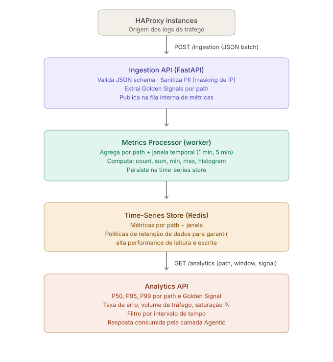

# log-ingestion-and-metrics

HAProxy log ingestion and Golden Signal analytics service for the
[Incident Response Copilot](../../README.md).

Part of **Phase 7** of the LIM sub-project.
Specs: [Spec LIM-01](specs/log-ingestion-api.md) · [Spec LIM-02](specs/analytics-api.md)

---

## Overview

This service ingests structured HAProxy JSON logs via a REST API, extracts the four
[Golden Signals](https://sre.google/sre-book/monitoring-distributed-systems/) per
backend path and time window, persists them in Redis, and exposes an analytics endpoint
that the `DetectionAgent` queries to trigger `incident.created` events.

### Pipeline



| Stage | Component                      | Responsibility                                                                                        |
| ----- | ------------------------------ | ----------------------------------------------------------------------------------------------------- |
| 1     | **HAProxy instances**          | Emit one structured JSON log entry per HTTP request                                                   |
| 2     | **Ingestion API** (FastAPI)    | Validate schema · mask PII (`client_ip`) · extract Golden Signals · publish to internal metrics queue |
| 3     | **Metrics Processor** (worker) | Aggregate by path + time window · compute count, sum, latency histogram · persist to Redis            |
| 4     | **Redis** (time-series store)  | Store metrics per path + window bucket with TTL-based retention                                       |
| 5     | **Analytics API**              | Serve P50/P95/P99 latency, error rate, traffic, saturation % to the Agentic layer                     |

---

## Golden Signals

Each ingested log entry produces exactly four `MetricPoint` objects:

| Signal         | Redis key                              | Value                      | Condition                                          |
| -------------- | -------------------------------------- | -------------------------- | -------------------------------------------------- |
| **Traffic**    | `lim:trx:{backend}:{path}:{window_ts}` | `INCR 1`                   | Always                                             |
| **Error**      | `lim:err4` / `lim:err5:{…}`            | `INCR 1`                   | `status_code ≥ 400` or `termination_state != "--"` |
| **Latency**    | `lim:lat:{backend}:{path}:{window_ts}` | `ZADD score=total_time_ms` | Always                                             |
| **Saturation** | `lim:sat:{backend}:{path}:{window_ts}` | `INCR 1`                   | `timers.wait > LIM_SAT_THRESHOLD_MS`               |

Latency percentiles (P50, P95, P99) are computed exactly via `ZCARD` + `ZRANGE`
(ADR-0035 — no probabilistic sketch).

---

## API Reference

### `POST /ingestion`

Ingest a single entry or a batch (max 1 000 entries).

**Request body** — single entry:

```json
{
  "timestamp": "2024-06-20T15:56:09",
  "client_ip": "192.168.1.50",
  "client_port": 44321,
  "frontend": "http-in",
  "backend": "web-servers",
  "server": "web-01",
  "status_code": 200,
  "bytes_read": 1450,
  "request": "GET /api/v1/data HTTP/1.1",
  "termination_state": "--",
  "timers": { "total_time": 105, "wait": 2, "connect": 1, "response": 102 }
}
```

**Request body** — batch: wrap multiple entries in a JSON array `[{…}, {…}]`.

**Responses:**

| Code  | Body                                           | Meaning                                 |
| ----- | ---------------------------------------------- | --------------------------------------- |
| `202` | `{"accepted": 3, "rejected": 0, "errors": []}` | Partial or full success                 |
| `422` | Pydantic error detail                          | Batch > 1 000 entries or malformed JSON |

### `GET /analytics`

Query Golden Signals for a backend + path + time window.

**Query parameters:**

| Parameter     | Required | Default         | Values                                         |
| ------------- | -------- | --------------- | ---------------------------------------------- |
| `backend`     | yes      | —               | any string                                     |
| `path`        | no       | all paths (`*`) | any string                                     |
| `signal`      | no       | all             | `traffic` · `error` · `latency` · `saturation` |
| `window`      | no       | `5m`            | `1m` · `5m` · `15m` · `1h`                     |
| `percentiles` | no       | `50,95,99`      | comma-separated integers 1–99                  |

**Response 200:**

```json
{
  "backend": "web-servers",
  "path": "/api/v1/orders",
  "window": "5m",
  "window_start_iso": "2026-05-17T14:30:00Z",
  "traffic": { "total_requests": 1842, "rps": 6.14 },
  "errors": {
    "rate_4xx": 0.012,
    "rate_5xx": 0.002,
    "total_4xx": 22,
    "total_5xx": 4
  },
  "latency_ms": { "p50": 32, "p95": 145, "p99": 412 },
  "saturation": { "high_wait_pct": 3.2, "threshold_wait_ms": 50 }
}
```

**Response 404:** no data for the requested combination in the current window.

### `GET /health/live` · `GET /health/ready`

| Endpoint        | 200                   | 503                                           |
| --------------- | --------------------- | --------------------------------------------- |
| `/health/live`  | `{"status": "alive"}` | Never                                         |
| `/health/ready` | `{"status": "ready"}` | `{"status": "not_ready"}` — Redis unreachable |

---

## Project Structure

```
services/log-ingestion-and-metrics/
├── images/
│   └── log_ingestion_pipeline.svg   # Pipeline architecture diagram
├── specs/
│   ├── log-ingestion-api.md         # Spec LIM-01 — POST /ingestion contract
│   └── analytics-api.md             # Spec LIM-02 — GET /analytics contract
├── src/
│   └── log_ingestion/
│       ├── domain/
│       │   ├── models/
│       │   │   ├── haproxy_log.py   # HaproxyLogEntry, HaproxyTimers, HaproxyLogBatch
│       │   │   ├── metric.py        # SignalType, MetricPoint, AnalyticsResult, sub-models
│       │   │   └── exceptions.py    # MetricStoreError, IngestionError
│       │   └── services/
│       │       ├── log_parser.py    # LogParser — entry → 4 MetricPoints per window
│       │       └── percentile_service.py  # PercentileCalculator — exact ZRANK rank math
│       ├── ports/
│       │   ├── metric_store_port.py # MetricStorePort ABC — driven port (Redis interface)
│       │   └── ingestion_port.py    # IngestionPort ABC + IngestionResult — driving port
│       ├── adapters/                # [#64] RedisMetricAdapter — not yet implemented
│       └── api/                     # [#65–#66] FastAPI routers — not yet implemented
├── tests/
│   ├── conftest.py                  # Shared fixtures (canonical HAProxy schema)
│   └── unit/
│       ├── test_haproxy_log.py      # 20 tests — schema validation, immutability, batch limit
│       ├── test_metric.py           # 14 tests — SignalType, MetricPoint, AnalyticsResult
│       ├── test_log_parser.py       # 23 tests — Golden Signal extraction, path, window
│       ├── test_percentile_service.py  # 23 tests — ADR-0035 rank formula, edge cases
│       └── test_ports.py            # 23 tests — ABC enforcement, IngestionResult invariants
└── pyproject.toml                   # Build, deps, pytest, ruff, mypy, import-linter config
```

---

## Architecture

The service follows Hexagonal Architecture (ADR-0002). Dependency direction is strictly
inward: `api → ports ← adapters`, with `domain` isolated from all outer layers.

```
┌─────────────────────────────────────────────────────────────┐
│  API layer (FastAPI routers)          [#65 · #66]           │
│  Driving adapters — call IngestionPort / MetricStorePort    │
└─────────────────────┬───────────────────────────────────────┘
                      │ calls
┌─────────────────────▼───────────────────────────────────────┐
│  Ports  (ABCs)                        [#63 ✅]              │
│  IngestionPort · MetricStorePort                            │
└──────────┬──────────────────────────────────────────────────┘
           │ implements                │ depends on
┌──────────▼────────────┐  ┌──────────▼──────────────────────┐
│  Domain               │  │  Adapters (Redis)    [#64]      │
│  [#61 · #62 ✅]       │  │  RedisMetricAdapter             │
│  models · services    │  │                                 │
└───────────────────────┘  └─────────────────────────────────┘
```

Import-linter enforces the boundaries (see `pyproject.toml`):

- `log_ingestion.domain` → zero imports from `adapters` or `api`
- `log_ingestion.ports` → zero imports from `adapters` or `api`
- `log_ingestion.adapters` → zero imports from `api`

---

## Environment Variables

| Variable                      | Default                    | Description                                               |
| ----------------------------- | -------------------------- | --------------------------------------------------------- |
| `LIM_SAT_THRESHOLD_MS`        | `50`                       | Queue wait (ms) above which a request counts as saturated |
| `REDIS_URL`                   | `redis://localhost:6379/0` | Redis connection URL                                      |
| `OTEL_EXPORTER_OTLP_ENDPOINT` | —                          | OpenTelemetry OTLP gRPC endpoint                          |

---

## Getting Started

**Prerequisites:** Python 3.12, Redis 7.x

```bash
# Install with dev dependencies (from this directory)
pip install -e ".[dev]"

# Run unit tests
PYTHONPATH=src pytest tests/unit/ -v

# Run with coverage
PYTHONPATH=src pytest tests/unit/ --cov=src --cov-report=term-missing
```

Integration tests (`tests/integration/`) require a live Redis instance via
[testcontainers](https://testcontainers.com/):

```bash
PYTHONPATH=src pytest tests/integration/ -v -m integration
```

---

## Linked ADRs

| ADR                                                                      | Decision                                                            |
| ------------------------------------------------------------------------ | ------------------------------------------------------------------- |
| [ADR-0002](../../docs/adr/ADR-0002-hexagonal-architecture.md)            | Hexagonal Architecture as structural pattern                        |
| [ADR-0011](../../docs/adr/ADR-0011-golden-signals.md)                    | Golden Signals as the four observability metrics                    |
| [ADR-0028](../../docs/adr/ADR-0028-pii-sanitization-llm-apis.md)         | PII sanitization — `client_ip` never leaves the validation boundary |
| [ADR-0030](../../docs/adr/ADR-0030-data-retention-ttl-policy.md)         | TTL policy — latency keys 24 h, counters 7 d                        |
| [ADR-0033](../../docs/adr/ADR-0033-lim-service-location-and-layout.md)   | LIM service location under `services/`                              |
| [ADR-0034](../../docs/adr/ADR-0034-redis-sorted-sets-latency-storage.md) | Redis Sorted Sets for latency distribution                          |
| [ADR-0035](../../docs/adr/ADR-0035-exact-zrank-percentile-algorithm.md)  | Exact ZRANK percentile — no probabilistic sketch                    |

---

## Implementation Status

| Layer                          | Issue                                                                                | Status             |
| ------------------------------ | ------------------------------------------------------------------------------------ | ------------------ |
| Specs + pyproject scaffold     | [#59](https://github.com/valdomirosouza/AgenticAI-2-Incident-Response-V.3/issues/59) | ✅ merged (v0.5.3) |
| ADRs 0033–0035                 | [#60](https://github.com/valdomirosouza/AgenticAI-2-Incident-Response-V.3/issues/60) | ✅ merged (v0.6.0) |
| Domain models                  | [#61](https://github.com/valdomirosouza/AgenticAI-2-Incident-Response-V.3/issues/61) | ✅ merged (v0.6.1) |
| Domain services                | [#62](https://github.com/valdomirosouza/AgenticAI-2-Incident-Response-V.3/issues/62) | ✅ merged (v0.6.2) |
| Ports (hexagonal ABCs)         | [#63](https://github.com/valdomirosouza/AgenticAI-2-Incident-Response-V.3/issues/63) | 🔄 PR #73 open     |
| Redis adapter                  | [#64](https://github.com/valdomirosouza/AgenticAI-2-Incident-Response-V.3/issues/64) | ⬜ pending         |
| POST /ingestion endpoint       | [#65](https://github.com/valdomirosouza/AgenticAI-2-Incident-Response-V.3/issues/65) | ⬜ pending         |
| GET /analytics endpoint        | [#66](https://github.com/valdomirosouza/AgenticAI-2-Incident-Response-V.3/issues/66) | ⬜ pending         |
| OTel + Prometheus + Dockerfile | [#67](https://github.com/valdomirosouza/AgenticAI-2-Incident-Response-V.3/issues/67) | ⬜ pending         |
| Full test suite + CI harness   | [#68](https://github.com/valdomirosouza/AgenticAI-2-Incident-Response-V.3/issues/68) | ⬜ pending         |
